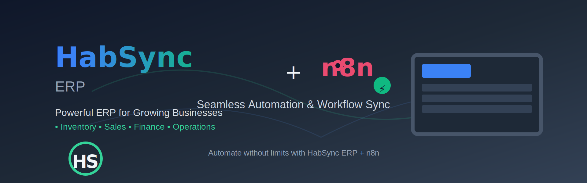
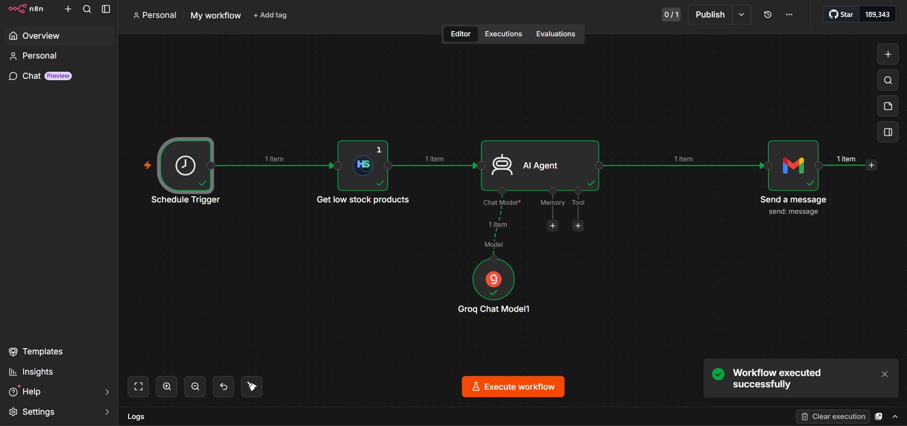
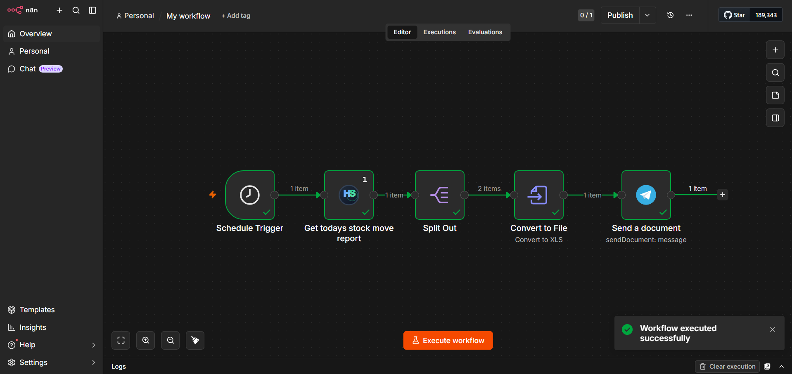
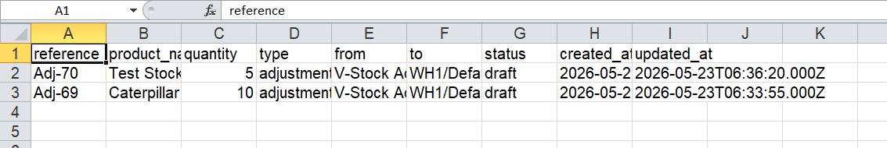

# HabSync n8n Nodes

Custom n8n nodes built for the HabSync ERP ecosystem.  
These nodes allow tenants to connect workflows directly with their HabSync instance and automate inventory, reporting, approvals, notifications, and operational processes.

Designed for multi-tenant SaaS and self-hosted ERP deployments.

---

## Features

- Connect n8n with HabSync ERP
- Multi-tenant architecture support
- Tenant API key authentication
- Prebuilt ERP automation actions
- Inventory workflow automation
- Reporting & analytics automation
- Event-driven triggers
- Extendable node structure
- Works with SaaS and self-hosted tenants

---

## Available Nodes

### Core Nodes

| Node | Description |
|------|------------|
| HabSync | Main ERP integration node |
| HabSync Trigger | Triggers workflows from ERP events |
| Inventory Actions | Stock and inventory automation |
| Reporting Actions | Scheduled and on-demand reports |
| Notification Actions | Send alerts and notifications |

---

## Sample Workflows

### 1. AI-Powered Low Stock Email Alert

This workflow automatically detects low stock products, summarizes the situation using AI, and emails a concise report to management.

Flow:

Schedule Trigger
Fetch low stock products from HabSync
Send data to AI Agent
Summarize using Groq AI model
Send summary via email



### 2. Daily Stock Movement XLS Report to Telegram
This workflow generates a daily stock movement report, transforms the data into spreadsheet format, and delivers it directly to Telegram.

Flow:

Schedule Trigger
Fetch today's stock movement report
Split & transform report data
Convert data to XLS/XLSX
Send report to Telegram




## Example Use Cases

### Inventory Automation
- Low stock alerts
- Inventory synchronization
- Daily warehouse summaries
- Auto reorder workflows

### Reporting
- Daily sales reports
- Inventory snapshots
- KPI exports
- Management dashboards

### Notifications
- Email alerts
- Telegram notifications
- ERP internal announcements

---

## Authentication

HabSync uses **Tenant API Keys** for secure access.

### Required Credentials

- HabSync n8n API Key

---

## Installation

### Community Nodes (n8n)

Go to:

`Settings → Community Nodes → Install`

Install package:

```bash
n8n-nodes-habsync
```

---

## Example Workflows

### Daily Inventory Report

1. Trigger scheduled workflow
2. Fetch inventory summary from HabSync
3. Generate report
4. Send to management

---

### Low Stock Alert

1. Detect stock threshold breach
2. Trigger workflow
3. Notify procurement team
4. Create purchase request

---

### ERP Sync

Sync data between HabSync and external systems:

- Products
- Inventory movements

---

## Security

- Tenant-isolated authentication
- Secure API communication
- Role-based access support
- API key rotation & revocation

---

## Compatibility

| Platform | Supported |
|----------|----------|
| n8n Cloud | Yes |
| Self-hosted n8n | Yes |
| Docker | Yes |
| VPS | Yes |

---

## Documentation

Coming soon:
- Full API reference
- Workflow templates
- Integration guides
- Advanced automation patterns

---

## Roadmap

- Additional ERP modules
- Webhook-based triggers
- AI-assisted workflows
- Power BI integration
- Advanced reporting engine
- Multi-system orchestration

---

## Support

- GitHub Issues
- HabSync Support Channel

---

## License

[MIT]
